# CSS Basics - Youstart Labs

Read the Basics of CSS from slides (PDF) [Link to Slide](../HTML_CSS.pdf).

Complete the below topics and their exercises. 

* CSS Basics
* CSS Selectors
* CSS Injection methods
* CSS overding priorities
* Using Devtools with CSS
* CSS common text properties
* CSS background
* CSS width height overflow
* CSS font properties
* Box model & directional properties
* CSS Box Shadow
* CSS borderradius
* CSS opacity
* CSS hover
* CSS transform

## 1. Setup CSS file

Create simple HTML page and link `style.css` to it.

## 2. Using ID selectors 

Create 3 paragraphs with 3 different styles. Use `color` and `background-color` CSS properties. Use `id` to apply 3 different styles

### Output

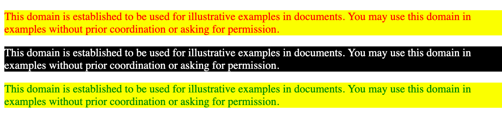

## 3. Class Styling

Use Class based styling to make some part of 2nd para graph as shown in white.

### Output

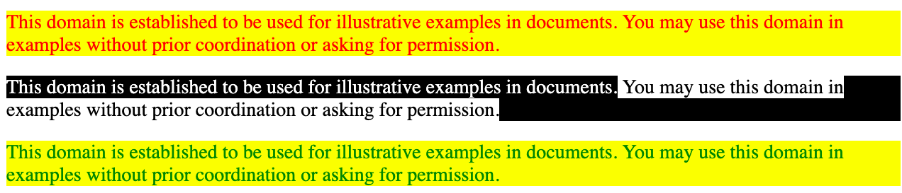

## 4. Inline styling

Use inline styling in 3rd paragraph to make text centered.

### Output

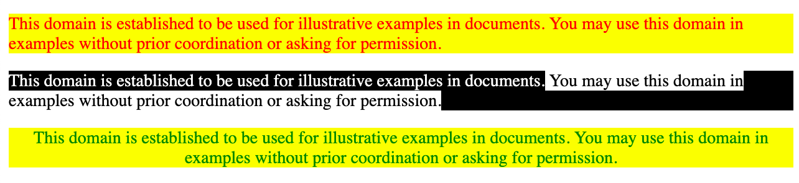

## 5. List Styling using Class

Create a simple unordered list and using `class` provide it a style as shown in output.

### Output

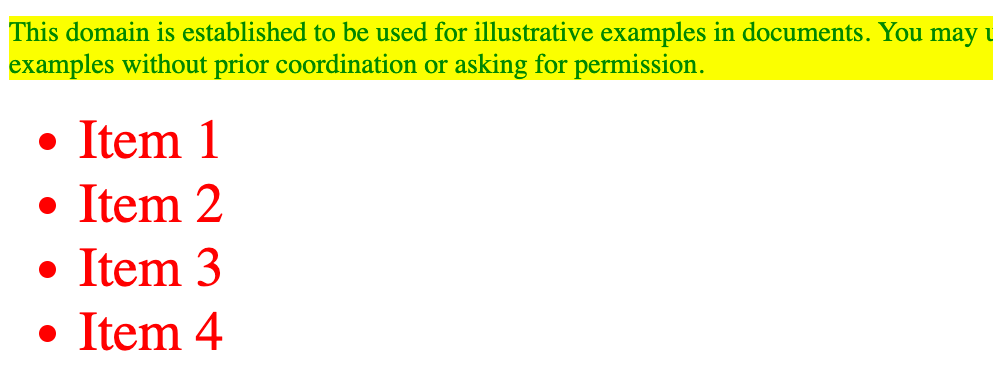

## 6. Removing List style

Remove bullet in list using `list-style` property. Also remove the `padding` which shift each list item to right side.

### Output

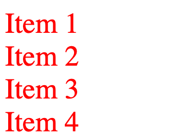

## 7. Styling the list

Make these changes to your list to match the output:
* Add background color.
* Provide some padding.
* Provide some margin.
* Provide a border of some thickness.

### Output

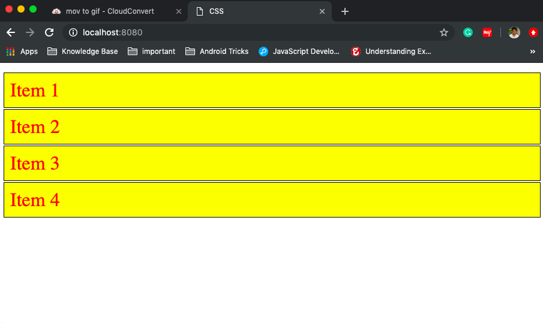

## 8. Add background image 

Add a background image of [star](https://www.iconfinder.com/icons/42362/favorite_star_icon) to list items. Use a small image of 48x48 size. Use `background-image`, `background-position` and `background-repeat` properties

### Output

## 9. Change Width in Percentage

Change `width` property of list to 50% and check as shown in output

### Output

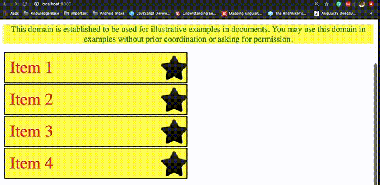

## 10. Hover effect

Make use of CSS pseudo class `:hover` to 

* change on hover color of list item
* change mouse pointer to hand sign, use `cursor` property

### Output

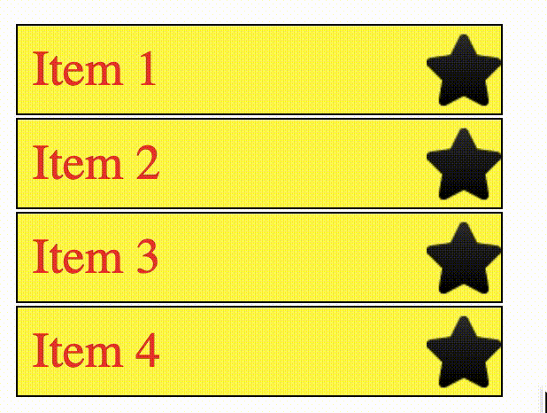

## 11. Transform list item

Shift the list item to right on hover using `transform` property with `translate` options.

### Output

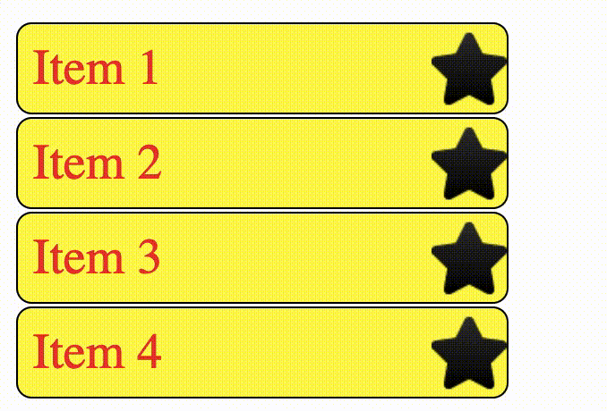

## 12. Opacity

On hover change the opacity of list icon using `opacity` property. Make it more transparent on Hover.

### Output

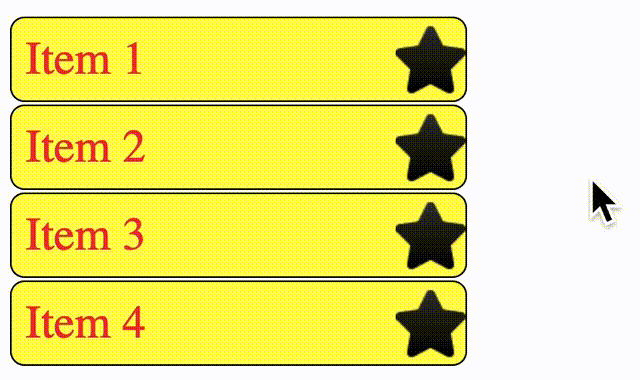

# Exercise CSS Positioning

Read about [CSS Flex](https://css-tricks.com/snippets/css/a-guide-to-flexbox/) 

## 1. Draw Stars

Create a new HTML file in same project. You can link the same `style.css` as used in previous part.
Using the same star icon as used in earlier exercises.
Create a structure similar to one given below with use of `div` and `img` tags

### Output

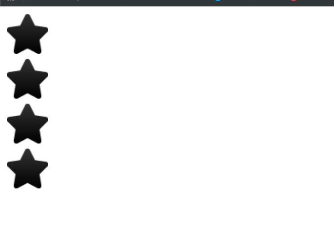

## 2. Flex

Wrap all `div` in parent `div` and provide a class `container` to it.     
Use `display` property as `flex` on `container` div.
You should get a similar result as in output 

### Output

## 3. Arrange flex items

Use flex related properties to align items with equal space around as shown in output

### Output

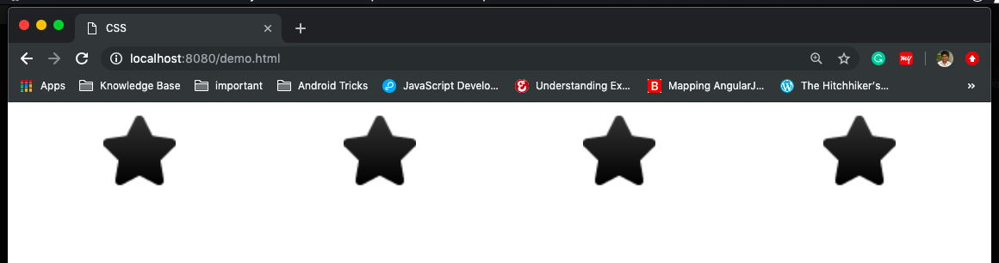

## 4. Arrange flex items vertically

Provide height of 300px to `container` `div`
Use flex related properties to align items vertically in center of `container` div.

### Output

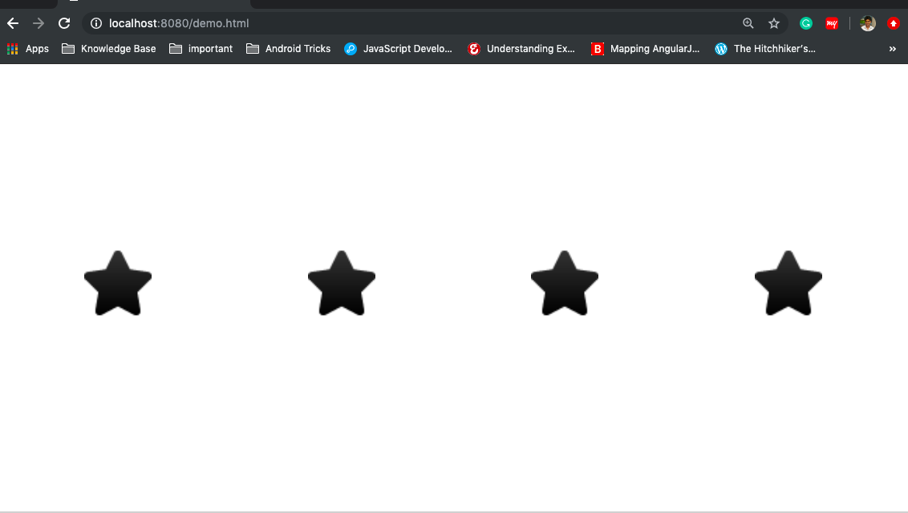

## 5. Use Absolute Postioning

Create a new div with star image icon as above. Arrange icon in bottom right of screen using `absolute` positioning

### Output

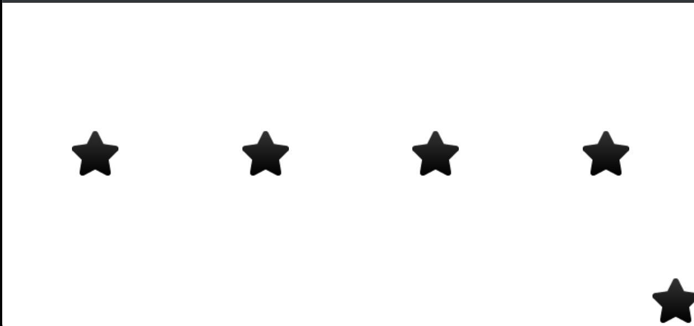

# Additonal Resources

* CSS Learning resources [Github Link](https://github.com/micromata/awesome-css-learning#css-in-a-nutshell)
* A curated list of awesome frameworks, style guide and other cool nuggets for the amazing CSS. [Github Link](https://github.com/awesome-css-group/awesome-css)
* Play CSS Diner Game [Here](https://flukeout.github.io/)
