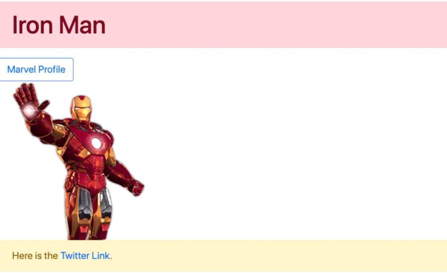
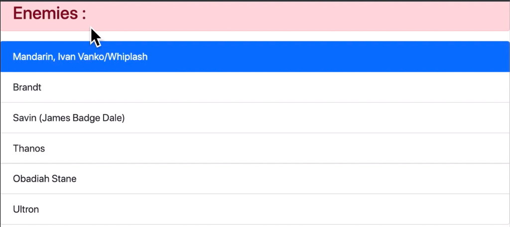
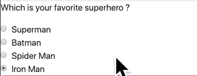
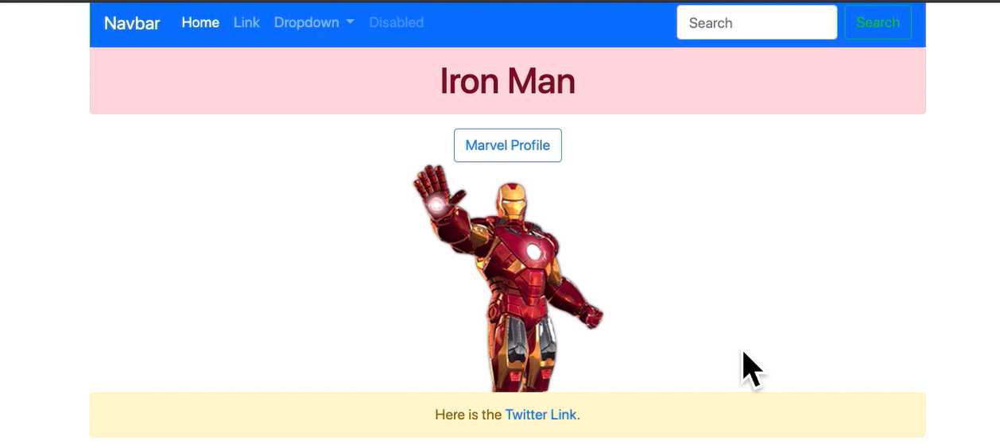
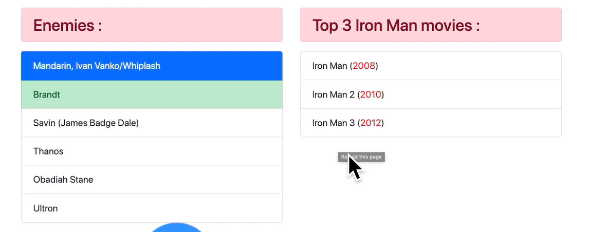
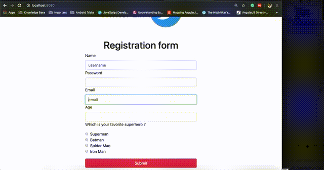

# BOOTSTRAP

Go through Common Concepts of BootStrap given below :

1. Basic Bootstrap Setup using npm
2. Read About Basic Components
    * [Alert](https://getbootstrap.com/docs/4.3/components/alerts/)
    * [Button](https://getbootstrap.com/docs/4.3/components/buttons/)
    * [List](https://getbootstrap.com/docs/4.3/components/list-group/)
    * [Forms](https://getbootstrap.com/docs/4.3/components/forms/)
    * [Navigation](https://getbootstrap.com/docs/4.3/components/navs/)
3. Some important utilities    
    * [Colors](https://getbootstrap.com/docs/4.3/utilities/colors/)
    * [Flex](https://getbootstrap.com/docs/4.3/utilities/flex/)
    * [Spacing](https://getbootstrap.com/docs/4.3/utilities/spacing/)
    * [Vertical Align](https://getbootstrap.com/docs/4.3/utilities/vertical-align/)
4. Layout 
    * [Containers](https://getbootstrap.com/docs/4.3/layout/overview/)
    * [Grid Layout](https://getbootstrap.com/docs/4.3/layout/grid/)   


## 1. Basic Bootstrap Setup using npm
You can use a copy of old HTML project to complete this bootstrap project.
Run these commands in terminal/cmd of your project folder

```javascript
 npm init -y
 npm install bootstrap
```

Once installed `link` `bootstrap.css` file to your HTML file

```HTML
     <link rel="stylesheet" href="node_modules/bootstrap/dist/css/bootstrap.css">

```

## 2. Bootstrap Basic Components : Alert/Button

Use `alert` and `button` classes and their different color combinations to complete this exercise.

### Output




## 3. Bootstrap Basic Components : List

Use `list-group` and `list-group-item` classes to complete this exercise and make a similar list

### Output



## 4. Bootstrap Forms

Use `form-control` class to make a responsive form as shown in output

### Output


## 5. Bootstrap form-check

Use `form-check`, `form-check-input`, `form-check-label` classes to make similar checkbox output

### Output



## 6. Centering Elements

Use grid layouts and `justify-content`,`text-center` classes to make centered elemets as shown in output

### Output



## 7. Make Responsive Grid

Create 2 list side-by-side using Bootstrap grid. List should collapse under each other in small screen for `sm` screen size

### Output



## 8. Make Responsive Form

Change the form to show only centered form which 50% of screen width in `md` screen size and above. For smaller screen size(`sm` and extra small) use 100% area of screen.

### Output

