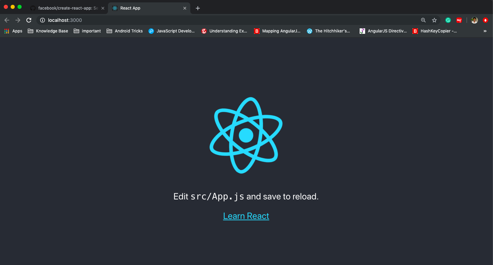
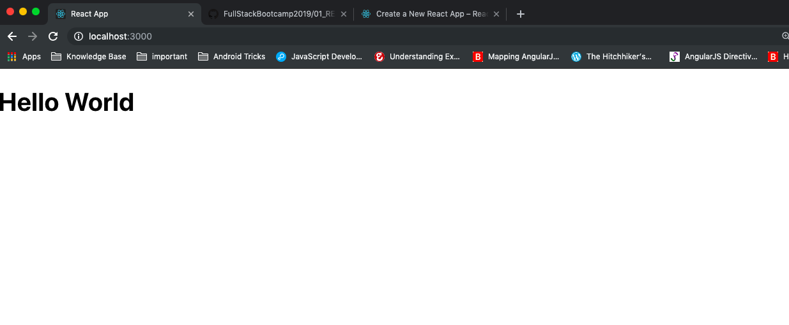
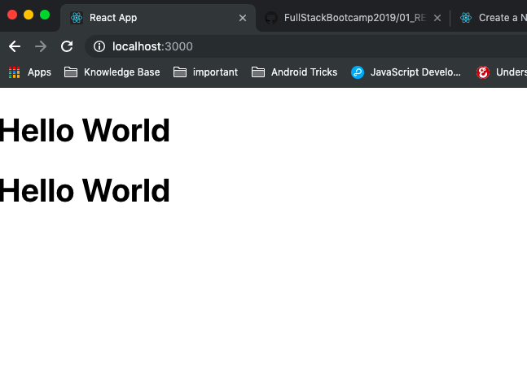
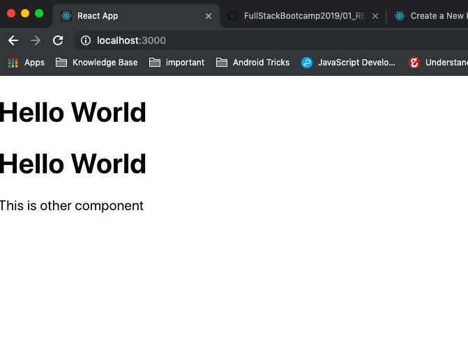
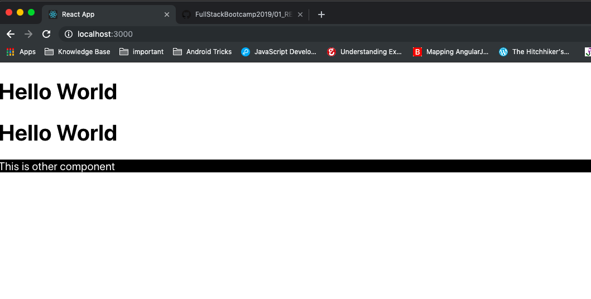
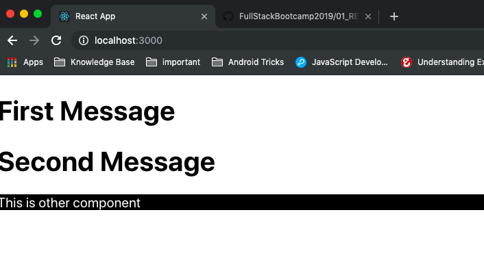
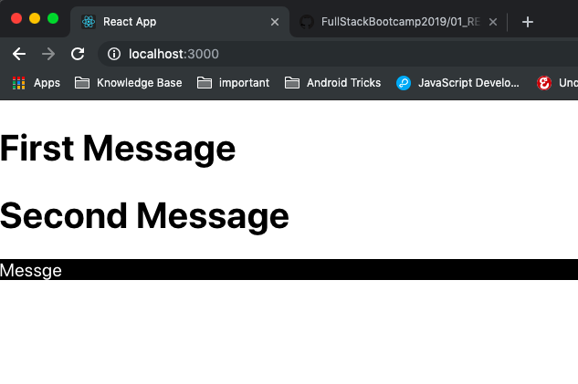
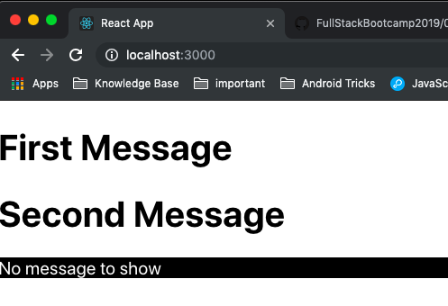

# REACT

## 1. Basic Setup using npm

Go to directory where you want to start new React project. Run this command to create a new project. You can change `my-app` to any other name of your project.

```javascript
npx create-react-app my-app
```

Once installed - move to the project directory in terminal (e.g. cd my-app)

Start your project by running the following command

```javascript

npm start
```

### Output




## 2. Change the App Component

Go to `App.js` and remove everything from the `return` part of function. After removing just return `<h1>Hello React</h1>` from your function. Save the file to see the output on browser

### Output



## 3. Change the JSX to have 2 Elements

Add one more `<h1>Hello React</h1>` in your return function. You should observe an error in browser at this moment. We can't return 2 elements as once. So, create a new parent element `div` which contains both `h1` heading. Check the output

### Output




## 4. Convert App component to Arrow function

Convert `function App` into arrow functions of ES6 standards. Output will still show the same thing browser.


## 5. Create Second Component

Create new component called `OtherComponent` it should return `<p>This is other component</p>`. Attach this component to `App` component after the 2 `h1` headings.

### Output



## 5. Add Style to the Component

Open `App.css` and remove all text conent from it. Create a class named `styled` with background `black` and text color `white`.
Add `className` `styled` to paragrah in `OtherComponent`.

### Output



## 6. Functional components & Props

In React components can be made in 2 styles, functional components or class components. Till now we have made `App` and `OtherComponent` which are functional components. We can pass `props` in functional components as first argument.

Let's pass and argument called `props` in `OtherComponent`. These props will contain all the attributes passed in `OtherComponent` as JS object.

You can use it as  `<OtherComponent cName='styled'/>`. This will be availble in function as `props.cName`. change the `className` value to `{props.cName}` and check the output.

Pass  props  in App Component `<App msg1='First Messgae' msg2='Second Messgae'/>`. use this `props.msg` in `h1` headings and check output.

### Output




## 7. Using if-else in components

In `OtherComponent` use `props` & `if` `else` statement to create an output like below :

1. When `msg` props is given - it should show the `msg` value in paragraph

### Output





2. When `msg` props is not given - it should show this message `No message to show`

### Output




## 7. Using ternary operators (?:)

In `OtherComponent` use `props` & `ternary operators`  to create an output like previous exercise.


## 8. Using For loop

In `App` use `for` loop to create the two Headings `h1` which are written before. You have to pass the two messages in single argument as an Array  e.g `<App msg={["First Message","Second Message"]} />`

As you can't concat JSX elements you will have to create an Array of JSX elements and push both `h1` elements. Finally, use this function as follows, where `messages` function will use `for` loop

```javascript
 <div>
      {messages()}
    <OtherComponent cName="styled" msg="hello react"/>
</div>

```

## 9. Using .map() for looping

Create the same output using `.map()` function on `props.msg`

```javascript

   function App(props){
   const JSX = props.msg.map((elem)=>(<h1>{elem}</h1>))
   }

```
maps are easy way to iterate over a collection and return a modified collection


## 10. Using Destructured props

You can use props in a destructured object format for easy access

```javascript

   function App({msg}){
         const JSX = msg.map((elem)=>(<h1>{elem}</h1>))
   }   // destructured prope into  {msg} so we can use msg instead of props.msg

```


## 11. Using PropTypes

PropTypes is used to ascertain that only a particular type of data types will be passed in props. If any other type is passed - React throws an error.

```javascript

import PropType from 'prop-types';

   function App({msg}){
   }

   App.propTypes = {
     msg : [PropTypes.string]
   }

```
## 12. Default Props

Default props are used to ascertain that default value will be passed in props, if no value is given in the code

```javascript

import PropType from 'prop-types';

   function App({msg}){
   }

   App.defaultProps = {
     msg : ["message1", "message2"]
   }

```


## 13. Class Based Components

Class based components have more features than function based components, such as passing states, life cycle handlers

```HTML

<App name="YouStart"/>

```

```js

class App extends React.Component {
  
  constructor(props){
    super(props);
  }

  render(){
    return <div>
     <h1>Hello World {this.props.name} </h1>
    </div>
  }
```


## 14. Methods and this binding

Methods can be called from any browser event, however care should be taken that they should be `bind` to main class `this` object.

```HTML

<App name="YouStart"/>

```

```js

class App extends React.Component {
  
  constructor(props){
    super(props);
    this.clickHandler = this.clickHandler.bind(this);
   
  }

  clickHandler(event){  // every Event Handler has first argument as Browser events
    console.log(event) 
    
  }

  render(){
    return <div>
     <h1>Hello World {this.props.name} </h1>
     <button onClick={this.clickHandler.bind(this)}}> Click </button>
    </div>
  }
}
```

You will find that "Hello World, YouStart" as the h1 heading. As props are read-only(immutable) we can't change the variable part of this. For a dynamic response we have to use state variables. 

### Output


## 15. Using Arrow functions to avoid binding 'this'

You can use arrow functions which don't change the context of functions and inherently pass 'this' of Component to the function.

```JSX
       <input onChange={(e)=>{this.clickHandler(e)}}/>
```


## 16. Using State

Props are read-only and can't be changed. So we need a gloal variable to store the change with the component. State is a global object which is used to change UI of your web components. Only when state is update DOM is updated. You can't change state object directly, so we use `setState` function which changes the state and refreshes the DOM.

```HTML

<App name="YouStart"/>

```

```js

class App extends React.Component {
  
    constructor(props){
      super(props);
      this.state = props   //copying props to this.state
  
    }
  
    clickHandler(event){  
      console.log(event) 
      this.setState({
        name : event.target.value
      })  // this changes name value of state and refreshed the DOM
    }
  
    render(){
      return <div>
       <h1>Hello World {this.state.name} </h1>   
       <input onChange={(e)=>{this.clickHandler(e)}}/>
      </div>
    }
  }

```

### Output


## 17. Parent-Child Component : Passing Props

Passing props from parent to child is quite simple and is done via the same way as before. We use the child components arguments to pass the props.

```js
const ChildComponent = (props)=>{

  return (<h3>Comopnent name is {props.name}</h3>)
  
}

const ParentComponent = (props)=>{

  const name = "MyChild";
  
    return (
      <div>  
      <h1>Parent Component</h1>
      <ChildComponent name="firstChild"></ChildComponent>
      </div>  
    )
  }
```

### Output 


## 18. Parent-Child Component : How to Pass state Up

Passing props from parent to child is quite simple and is done via the same way as before. We use the child components arguments to pass the props.

```js

  class Parent extends React.Component {
  
    constructor(props){
      super(props);
      this.state = props;
      this.clickHandler=this.clickHandler.bind(this)
    }
  
    clickHandler(event){  
      console.log(event) 
      this.setState({
        name : event.target.value
      })  
    }
  
    render(){
      return <div>
       <h1>Hello World {this.state.name} </h1>   
       <InputBox click={this.clickHandler}/>
      </div>
    }
}
 

class InputBox extends React.Component {
  
    constructor(props){
      super(props);
      
  
    }
 render(){
      return <div>
        <input onChange={(e)=>{this.props.click(e)}}/>
      </div>
  }
}

```


### Output 


## 19. LifeCycle Events

In React Component there are few lifecycle events which can be used to initialize some conditions or do the cleanup after some component changes.

* `componentDidMount()` : method runs after the component output has been rendered to the DOM.
* `componentWillMount()` : method runs before the component output has been rendered to the DOM. 
* `componentDidUnmount()` : method runs after the component is removed from DOM.
* `componentWillUn,ount()` : method runs before the component is removed from DOM.

```js

class App extends React.Component {
  constructor(props) {
    super(props);
   
  }

  componentDidMount() {

  }

  componentWillUnmount() {

  }

```  
