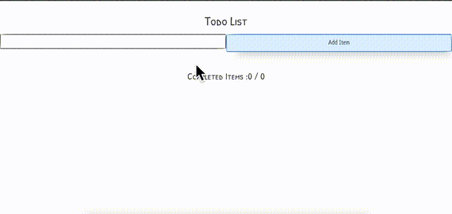

# Project 1 - TODO App

Todo app can be used to maintain a list of your pending daily items. A Simple todo list must have these features

* You can add any new item to TODO list
* You can click on any item to mark it as done, if you have done that by mistake - you can click again to undo.
* You can delete any item (completed or pending)
* You get a total of completed items and overall items on the list.
* You can move list items "Up" or "Down" using buttons.

## Additional Features

* Enter Animation : Animate list item on adding.
* Exit Animation : Animate list item at removal.
* Pin element to Top of List : On double click make element reach top of list. You can show a different color also to show that element is pinned.
* Show the date & time at which list item was added.
* Order by : Todo Item names, Date added, Completed.
* Due date feature : Add a due date of task of any todo item. You will need to add another input box for this at top. Whenever you are in 24 hour limit of due date - Task outline will be shown in ORANGE color. e.g if a task is due on 23 May - from 22nd May it should show in ORANGE outline color. If a due date is passed task should show RED Outline.
* Use some component like `https://github.com/react-component/progress` to show a progress bar at top of list. This progress bar will show how much of total percent of tasks are completed.
* Delete item via swipe gesture - like swipe to right on mobile phone.
* Use localStorage in browser using libraries like `https://github.com/localForage/localForage` to make your todo list permanent in browser. This will have your list stored in browser database and will not delete it on refresh or closing of browser.

