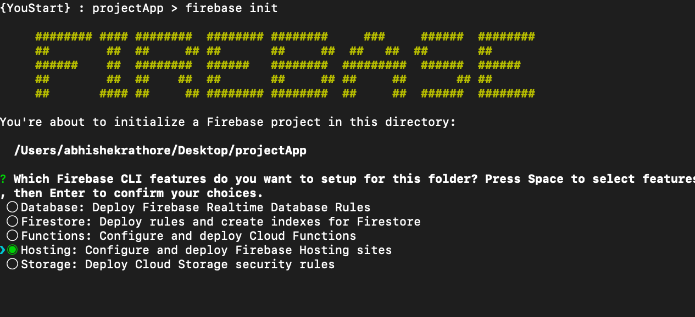
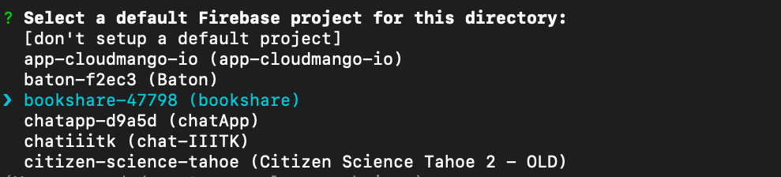
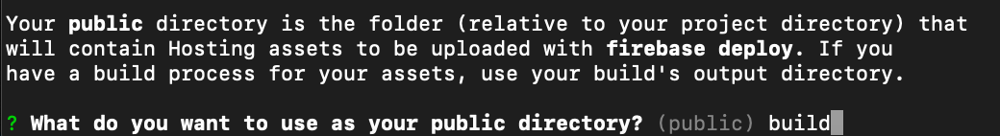
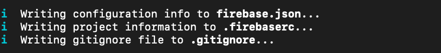

# Build React Application

To build an application in pure HTML/CSS/JS code ready for production site :


```js
npm run build
```

This will create a directory called `build` in your project folder. You can take build folder to your hosting server and use it for deployment.


# Deploy using Firebase CLI (Google Cloud)

## General Setup [ One time installation ]

To deploy a simple front-end only application you can use free hosting provided by firebase(Google cloud). Follow these steps to host your site :

* Login to your Google account in browser and then go to `https://firebase.com`
* Go to console - and create a new project.
* Now install `Firebase CLI` tools on your system using `npm install -g firebase-tools`.
* After installing Firebase CLI run command to login :

```
firebase login
```
This will let you login into your google account and save the credentials in your system.


## Hosting Project

* Go to your `React` project which you want to host. And run command `npm build` if not done already.
* Run command `firebase init` in your project. Make sure you are in project folder, and build folder is created before this step
* You will be asked few questions on setup :

   1. You will have to choose what type of firebase cloud service you want to use. Choose `hosting` here. Use Up/Down keyboard arrows to move and spacebar to select an option.

   

   2. You will have to choose your project name which you created in Firebase console. 

    

    3. You will have to choose what is your project folder. In case on react project it will be `build` folder as it contains final `index.html` file.
    

   4. You will be asked to rewrite URL to index.html . Type `y`

    

   5. If asked to overwrite index.html. Type `N`

   6. Finally you will see some files like firebase.json being created. They should be created just outside `build` folder.

    


