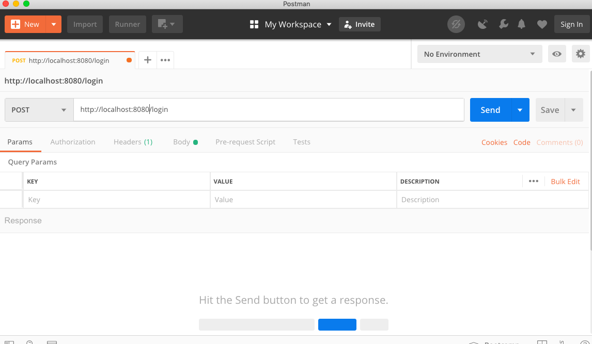

# Node.js Runtime & Express Framework 

Node is a run-time environment for Javascript which is based on chrome V8 engine. You can run your JS programs directly using `node`. Let say your code is in a file `index.js`. To run that file in node :

```javascript

node index.js

```


## Dependencies in Node Project

In Node we can use any library which is available on `npm` repositories. To initialize a node project, write commands :

```javascript

npm init

```

This will create a `package.json` file in your repository which contains all information about this project, including name, version number, dependencies etc. Here dependencies will contain the NPM libraries you are using in your project.

One can install any library using `npm install` command.

```javascript

npm install <packagename>

```

## Using Node as Web Server

One of the popular use of NodeJS is to use this as the Web server. However that is not what node can only do - but since it is Javascript based - web server seems to be the most popular option. Node has built-in modules for HTTP/HTTPS. However, node has very low-level instructions.

To create a simple server in NodeJS you need to write a lot of lines to send a response packet, like adding headers, adding body and sending final data. There is a better way to do all these in form of Express framework. Let's jump to that

# ExpressJS Framework

ExpressJS is the de-facto standard for web development using NodeJS these days. Express has a minimalistic but a great set of functions used to do server-side coding.

## Express setup

It is quite simple to create a simple API using Express.

To install express :

```javascript
npm install express
```

Use ExpressJS in your project, we use `require` to import any library installed using npm, Normal `import` keyword is not supported in nodejs yet:

```javascript
const express = require('express');
```

Let's see the code of a simple server using Express:

```javascript

const express = require("express");
const server = express();

server.listen(8080,function(){
    console.log("server started")
})

```
### Lab Task 1

Setup the above mention server and observe the output in your browser.
This server will do nothing but send `404` to any request as it has no end points. Checkout this server by typing `http://localhost:8080` in your browser.

## Creating API using ExpressJS

Let's create a `GET` API endpoint which returns always a simple "hello" string in response.

```javascript

const express = require("express");
const server = express();

server.get("/demo",function(req,res){
    res.send("hello");
})

server.listen(8080,function(){
    console.log("server started")
})

```

### Lab Task 2

Make above server with API endpoint `/demo`. 
1. Try to call this API in your browser `http://localhost:8080/demo` - this will return a string `"hello"` in response.

2. To make API return JSON response - just change the response line to  and restart server again:

```javascript
    res.json({name:"hello"});
```

## Request and Response objects

In last example you have seen, two parameters in API callback function - these are `request` object and `response` object of HTTP in nodejs environment.

### Request Object

Request object comprises of many properties, but important ones are :

- Type of Request : GET, POST, PUT, DELETE etc.
Headers : Meta data sent by your browser like browser name, cookies, authentication information etc.
- Query String (url?`name=john`) : This is used in GET requests to send data to server
- Route Params (url/`john`) 
- Body data : This is used in POST and other requests to send data to server

3 major ways of sending data from client to server via request are :

**1. Send data via URL in Query String**

This is easiest method to send data and mostly used in GET request.

When you have URL with `?name=Youstart&subject=express` at end, it translates in a query string. In query string each key,value pair is separated by `=` and between 2 such pairs we put `&`.

To read such data in express you can use `req.query` :

```js

server.get("/demo",function(req,res){
    console.log(req.query) // prints all data in request object
    res.send(req.query);  // send back same data in response object
})


```


### Lab Task 3

Make above server with API endpoint `/demo` as shown above :

1. Try to call this API in your browser `http://localhost:8080/demo?name=Youstart` - this will return a response of `req.query`  JSON object

2. Create 3 query parameters `name`, `age`, `subject` with some values. Check the final output of `req.query` - can you find all data on server side. Can you send it back to client via `res` object.


**2. Send data via Request Params**


In this method you can have a URL with url path like `/Youstart/express` at end it translates in a param string. In param part string each value is separated by `/`. As you can see that URL only contains `value` not the `key` part of data. `key` part is decided by the endpoint definition at express server

```js

server.get("/demo/:name/:subject",function(req,res){
    console.log(req.params) // prints all data in request object
    res.send(req.query);  // send back same data in response object
})

```

So sequence of values matter in this case. As values sent from client are matched with `name` and `subject` params of URL later.


### Lab Task 4

Make above server with API endpoint `/demo` as shown above :

1. Try to call this API in your browser `http://localhost:8080/demo/Youstart/Express` - this will return a response of `req.params`  JSON object

2. Create 3 URL params  `name`, `age`, `subject` . Call the URL and check the final output of `req.params` - can you find all data on server side. Can you send it back to client via `res` object.


**3. Send data via Request Body**

Final method of sending data is via body part of request. We can send data directly to body using URL. We have to either use one of these methods

1. Use a HTML Form and make `method` value as `POST`. This will make all name=value pair to go via body of request.

2. Use special browsers like POSTMAN to change the body directly. (We will see this example in next classes)

```js

server.post("/demo",function(req,res){
    console.log(req.body) // prints all data in request object
    res.send(req.body);  // send back same data in response object
})

```


## Response Object

Response object comprises of many properties, but important ones are :

- Headers : Meta data sent by your server back to client like server name, content size, last updated time etc.
- Response status code (`200`, `404`, `403`, `502`)
- Response body : Actual data to be sent to client : HTML, JS, JSON, CSS, Image etc.

There are various methods in express response object :

```js
res.send("Hello")   // to send HTML or plain text
res.json({name:"Youstart"}) // to send JSON data 
res.status(404) // to change status code of response

```


## POSTMAN API browser

AS you know we can create GET request from any browser using the URL, however it is not easy to create request like POST, PUT, DELETE etc. For that you generally need a form to be created with lots of input boxes which have `name` and `value` attribute set properly. However to test a server response of GET/POST and other request one don't need to put so much of effort.

POSTMAN makes it easy to test API endpoints without creating any HTML or JS Code.

The basic interface of postman looks like. Where you can change URL and also type ot request you want to do. Also you can change query params, form data and other variables in the HTTP request.



You can also pass JSON data in Request body using raw body data, this will be very useful when you will integrate your backend with front-end application which exchange all data in JSON format. (JS objects):


## Lab Task 5

Check output of all Lab Tasks above with POSTMAN browser. Do you find any differences.

